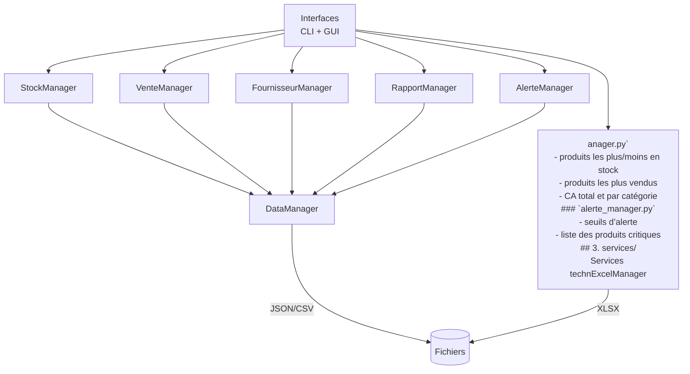
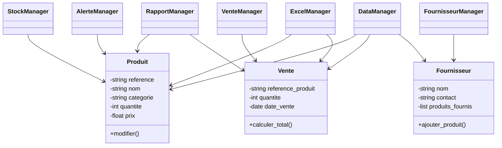

# Architecture complète du projet
## Arborescence générale

```
gestion_stocks/
│
├── data/                      # Données persistantes
│   ├── produits.json
│   ├── ventes.json
│   ├── fournisseurs.json
│   ├── produits.xlsx
│   ├── ventes.xlsx
│
├── src/                       # Code source principal
│   ├── main.py                # Point d'entrée de l'application
│   │
│   ├── models/                # Classes métiers (données)
│   │   ├── produit.py
│   │   ├── vente.py
│   │   └── fournisseur.py
│   │
│   ├── managers/              # Gestionnaires (logique métier)
│   │   ├── stock_manager.py
│   │   ├── vente_manager.py
│   │   ├── fournisseur_manager.py
│   │   ├── rapport_manager.py
│   │   └── alerte_manager.py
│   │
│   ├── services/              # Services techniques
│   │   ├── data_manager.py    # JSON/CSV
│   │   ├── excel_manager.py   # Import/export Excel
│   │   └── utils.py           # Fonctions utilitaires
│   │
│   ├── interfaces/            # Interfaces utilisateur
│   │   ├── cli.py             # Interface console
│   │   └── gui.py             # Interface Tkinter
│   │
│   └── config/                # Paramètres globaux
│       └── settings.py
│
└── README.md
```

---

# Description des modules
## 1. models/
Contient les classes représentant les données manipulées.
### `produit.py`
- référence
- nom
- catégorie
- quantité
- prix
### `vente.py`
- référence produit
- quantité vendue
- date
- total calculé
### `fournisseur.py`
- nom
- contact
- liste des produits fournis
## 2. managers/
Contient la logique métier.
### `stock_manager.py`
- ajouter / modifier / supprimer produit
- rechercher produit
- afficher produits
- détecter stock faible
### `vente_manager.py`
- enregistrer vente
- mettre à jour stock
- statistiques de ventes
### `fournisseur_manager.py`
- ajouter / modifier / supprimer fournisseur
- associer produit à fournisseur
### `rapport_manager.py`
- produits les plus/moins en stock
- produits les plus vendus
- CA total et par catégorie
### `alerte_manager.py`
- seuils d’alerte
- liste des produits critiques
## 3. services/
Services techniques indépendants de la logique métier.
### `data_manager.py`
- chargement JSON/CSV
- sauvegarde JSON/CSV
- validation des fichiers
### `excel_manager.py`
- import produits/ventes depuis Excel
- export produits/ventes vers Excel
### `utils.py`
- formatage
- validation
- conversions
## 4. interfaces/
Deux interfaces utilisateur :
### `cli.py`
- menus textuels
- saisie utilisateur
- affichage console
### `gui.py`
- interface Tkinter
- formulaires
- tableaux
- pop-ups
## 5. config/
### `settings.py`
- chemins des fichiers
- seuils de stock faible
- paramètres d’interface
# Architecture logique (Mermaid)
## Diagramme d’architecture



# Architecture orientée objets (Mermaid UML)


