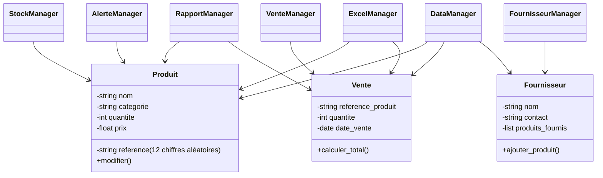
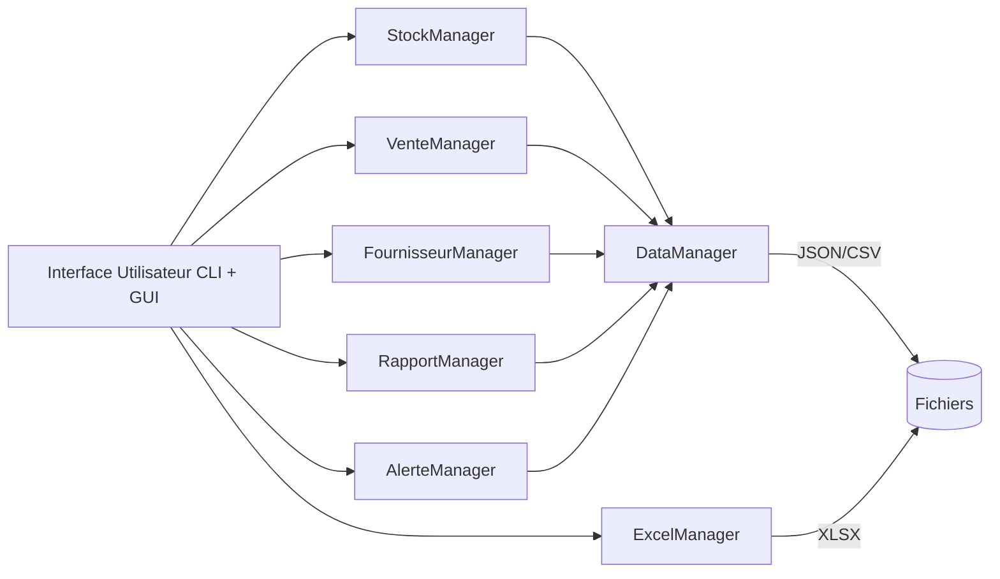
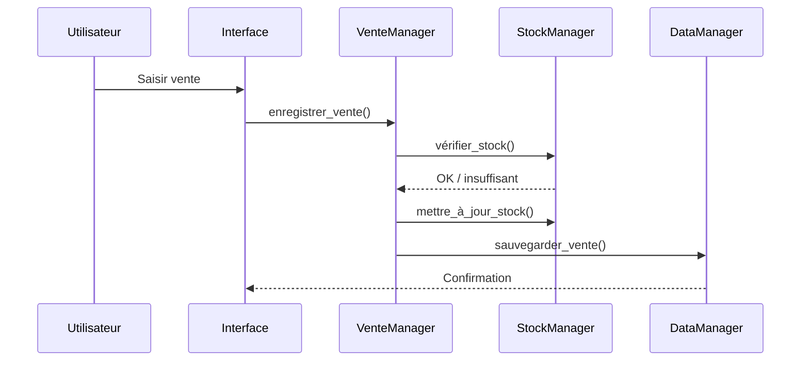

# OpenInventory - Application de Gestion des Stocks

## Présentation du projet
Cette application Python permet à une petite entreprise de gérer l’ensemble de son inventaire, ses ventes, ses fournisseurs, ses alertes de stock faible et l’import/export de données au format Excel.
Elle propose deux modes d’utilisation : une interface console et une interface graphique Tkinter.

Toutes les fonctionnalités obligatoires et toutes les extensions sont intégrées.

---

## Fonctionnalités

### 1. Gestion des produits
- Ajout d’un produit avec :
  - Nom
  - Catégorie
  - Quantité
  - Prix unitaire
- L’ID du produit est généré automatiquement par l’application :
  - Nombre aléatoire à 12 chiffres
  - Exemple : 482910374652
  - L’utilisateur ne saisit jamais l’ID
- Modification d’un produit (nom, prix, quantité, catégorie)
- Suppression d’un produit
- Recherche d’un produit (par nom ou catégorie)
- Affichage des produits :
  - par catégorie
  - par quantité
  - tri croissant/décroissant

---

### 2. Suivi des ventes
- Enregistrement d’une vente :
  - Référence du produit
  - Quantité vendue
  - Date de la vente
- Mise à jour automatique du stock
- Calcul automatique du montant total
- Historique complet des ventes
- Rapports :
  - produits les plus vendus
  - chiffre d’affaires total
  - ventes par période

---

### 3. Rapports et statistiques
- Produits les plus en stock
- Produits les moins en stock
- Produits les plus vendus
- Chiffre d’affaires global
- Chiffre d’affaires par catégorie
- Statistiques d’évolution du stock

---

### 4. Persistance des données
- Sauvegarde automatique en JSON ou CSV
- Chargement automatique au démarrage
- Vérification de l’intégrité des fichiers
- Gestion des fichiers corrompus

---

### 5. Interface utilisateur

#### Interface console
- Menus interactifs
- Saisie guidée
- Messages d’erreur explicites

#### Interface graphique Tkinter
- Fenêtre principale
- Formulaires d’ajout et de modification
- Tableaux d’affichage
- Boutons d’action
- Pop-ups d’erreur et de confirmation

---

### 6. Import / Export Excel
- Export des produits en `.xlsx`
- Export des ventes en `.xlsx`
- Import des produits depuis Excel
- Import des ventes depuis Excel
- Vérification des colonnes et des valeurs

---

### 7. Système d’alertes de stock faible
- Détection automatique des produits sous un seuil configurable
- Affichage des produits critiques
- Rapport dédié

---

### 8. Gestion des fournisseurs
- Ajout d’un fournisseur :
  - Nom
  - Contact
  - Produits fournis
- Modification d’un fournisseur
- Suppression d’un fournisseur
- Association produit ↔ fournisseur
- Rapport “produits par fournisseur”

---

## Gestion des erreurs
L’application gère notamment :
- produit introuvable
- stock insuffisant
- prix ou quantité invalides
- date incorrecte
- fichier JSON/CSV/Excel corrompu
- fournisseur introuvable
- champ obligatoire vide
- tentative d’utiliser un ID produit fourni par l’utilisateur (interdit)

---

## Structure du projet

```
gestion_stocks/
│
├── data/
│   ├── produits.json
│   ├── ventes.json
│   ├── fournisseurs.json
│   ├── produits.xlsx
│   ├── ventes.xlsx
│
├── src/
│   ├── main.py
│   │
│   ├── models/
│   │   ├── produit.py
│   │   ├── vente.py
│   │   └── fournisseur.py
│   │
│   ├── managers/
│   │   ├── stock_manager.py
│   │   ├── vente_manager.py
│   │   ├── fournisseur_manager.py
│   │   ├── rapport_manager.py
│   │   └── alerte_manager.py
│   │
│   ├── services/
│   │   ├── data_manager.py
│   │   ├── excel_manager.py
│   │   └── utils.py
│   │
│   ├── interfaces/
│   │   ├── cli.py
│   │   └── gui.py
│   │
│   └── config/
│       └── settings.py
│
└── README.md
```

---

## Diagrammes Mermaid

### Diagramme UML — Classes principales



---

### Architecture générale



---

### Flux — Enregistrement d’une vente


