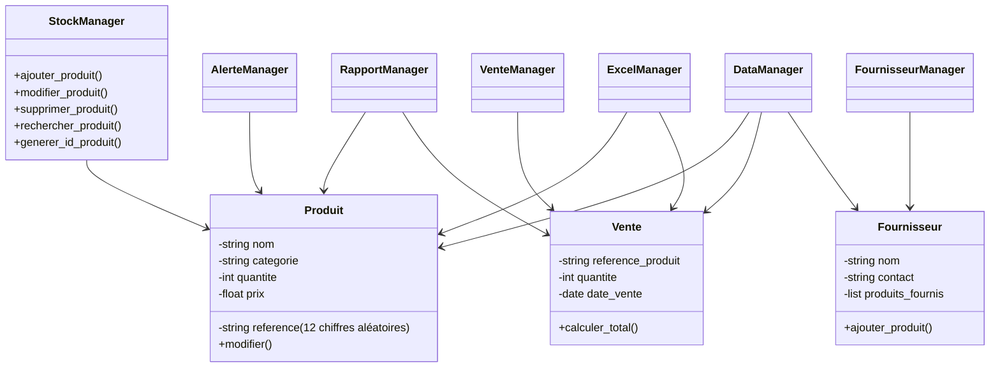
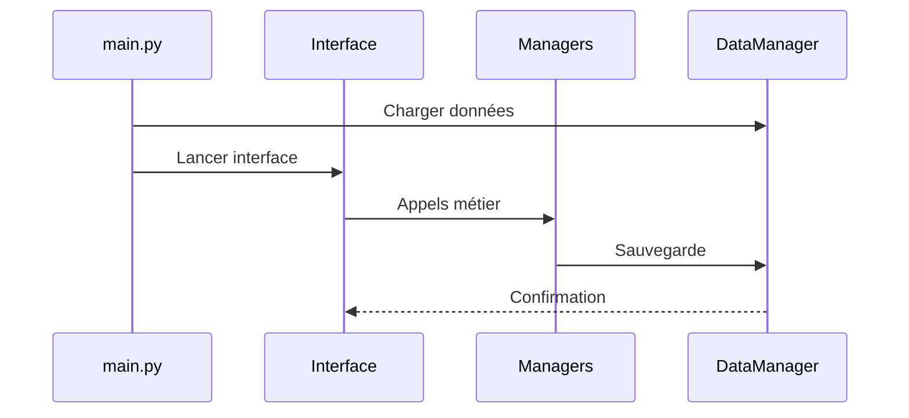

# Documentation Technique — Application de Gestion des Stocks

## 1. Introduction
Cette documentation s’adresse aux développeurs amenés à maintenir ou étendre l’application.  
Elle décrit l’architecture interne, les modules, les classes, les règles métier, les formats de données et les flux de fonctionnement.

L’application est conçue pour être modulaire, robuste et facilement extensible.

---

## 2. Architecture générale

L’application suit une architecture modulaire inspirée du modèle MVC, adaptée à Python.

### Arborescence du projet

```
gestion_stocks/
│
├── data/
│   ├── produits.json
│   ├── ventes.json
│   ├── fournisseurs.json
│   ├── produits.xlsx
│   ├── ventes.xlsx
│
├── src/
│   ├── main.py
│   │
│   ├── models/
│   │   ├── produit.py
│   │   ├── vente.py
│   │   └── fournisseur.py
│   │
│   ├── managers/
│   │   ├── stock_manager.py
│   │   ├── vente_manager.py
│   │   ├── fournisseur_manager.py
│   │   ├── rapport_manager.py
│   │   └── alerte_manager.py
│   │
│   ├── services/
│   │   ├── data_manager.py
│   │   ├── excel_manager.py
│   │   └── utils.py
│   │
│   ├── interfaces/
│   │   ├── cli.py
│   │   └── gui.py
│   │
│   └── config/
│       └── settings.py
│
└── README.md
```

---

## 3. Diagrammes techniques

### 3.1 Diagramme UML des classes



---

## 4. Description des modules

### 4.1 models/

#### produit.py
Représente un produit en stock.

Attributs :
- `reference : str`  
  - générée automatiquement  
  - 12 chiffres aléatoires  
- `nom : str`
- `categorie : str`
- `quantite : int`
- `prix : float`

Méthodes :
- `modifier(nom, categorie, quantite, prix)`

Règle métier :
- L’utilisateur ne fournit jamais la référence.
- La référence est générée par `StockManager.generer_id_produit()`.

---

#### vente.py
Attributs :
- `reference_produit : str`
- `quantite : int`
- `date_vente : datetime`

Méthodes :
- `calculer_total(prix_unitaire)`

---

#### fournisseur.py
Attributs :
- `nom : str`
- `contact : str`
- `produits_fournis : list[str]`

Méthodes :
- `ajouter_produit(reference)`

---

### 4.2 managers/

#### stock_manager.py
Responsable de :
- ajouter un produit  
- générer automatiquement un ID produit  
- modifier un produit  
- supprimer un produit  
- rechercher un produit  
- détecter les stocks faibles  

Méthode clé : génération de l’ID produit

```python
import random

def generer_id_produit(self):
    while True:
        identifiant = "".join(str(random.randint(0, 9)) for _ in range(12))
        if identifiant not in self.produits:
            return identifiant
```

Caractéristiques :
- 12 chiffres  
- aléatoire  
- garanti unique  

---

#### vente_manager.py
Responsable de :
- enregistrer une vente  
- vérifier le stock  
- mettre à jour le stock  
- calculer les statistiques de ventes  

---

#### fournisseur_manager.py
Responsable de :
- ajouter / modifier / supprimer un fournisseur  
- associer un produit à un fournisseur  

---

#### rapport_manager.py
Génère :
- produits les plus/moins en stock  
- produits les plus vendus  
- chiffre d’affaires total  
- CA par catégorie  

---

#### alerte_manager.py
Gère :
- seuils d’alerte  
- liste des produits critiques  

---

### 4.3 services/

#### data_manager.py
Responsable de la persistance JSON/CSV.

Fonctions :
- `charger_produits()`
- `sauvegarder_produits()`
- `charger_ventes()`
- `sauvegarder_ventes()`
- `charger_fournisseurs()`
- `sauvegarder_fournisseurs()`

---

#### excel_manager.py
Utilise openpyxl.

Fonctions :
- `exporter_produits()`
- `exporter_ventes()`
- `importer_produits()`
- `importer_ventes()`

---

#### utils.py
Fonctions utilitaires :
- validation de données  
- formatage  
- conversion de dates  

---

### 4.4 interfaces/

#### cli.py
- menus textuels  
- saisie utilisateur  
- affichage console  

#### gui.py
- interface Tkinter  
- formulaires  
- tableaux  
- pop-ups  

---

## 5. Formats de données

### 5.1 produits.json

```json
{
  "482910374652": {
    "nom": "Clavier",
    "categorie": "Electronique",
    "quantite": 25,
    "prix": 19.99
  }
}
```

---

### 5.2 ventes.json

```json
[
  {
    "reference_produit": "482910374652",
    "quantite": 2,
    "date_vente": "2024-01-15"
  }
]
```

---

### 5.3 fournisseurs.json

```json
{
  "Fournisseur A": {
    "contact": "contact@mail.com",
    "produits_fournis": ["482910374652"]
  }
}
```

---

## 6. Gestion des erreurs

Exceptions recommandées :
- `ProduitIntrouvableError`
- `StockInsuffisantError`
- `FournisseurIntrouvableError`
- `FormatInvalideError`
- `FichierCorrompuError`

Règles importantes :
- L’ID produit ne peut jamais être saisi par l’utilisateur.  
- Toute tentative de fournir un ID doit être ignorée ou signalée.  
- Les IDs doivent être validés : 12 chiffres uniquement.  

---

## 7. Conventions de développement

- Style : PEP8  
- Classes : PascalCase  
- Fonctions : snake_case  
- Constantes : UPPER_SNAKE_CASE  
- Docstrings : format Google  
- Tests unitaires recommandés : pytest  

---

## 8. Dépendances techniques

- Python 3.x  
- Tkinter  
- openpyxl  
- json  
- csv  
- datetime  

---

## 9. Processus d’exécution

